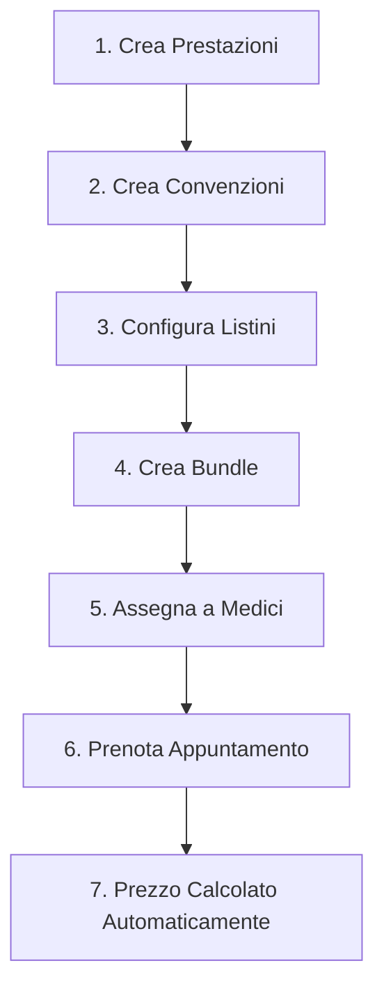

# Guida Tariffario Avanzato e Bundle

## 📚 Panoramica

Il sistema Tariffario Avanzato permette di gestire:
1. **Prezzi base** delle prestazioni
2. **Listini personalizzati** per medico, convenzione, poliambulatorio
3. **Bundle/Pacchetti** di prestazioni con sconto

---

## 🏗️ Struttura Gerarchica dei Prezzi

```
Prestazione (prezzoBase)
    └── ListinoPrezzo (override prezzo)
            ├── Per Poliambulatorio
            ├── Per Convenzione  
            ├── Per Medico (Tariffario Avanzato)
            └── Combinazioni (es. Medico + Convenzione)
```

### Priorità Applicazione Prezzo

Quando si calcola il prezzo di una prestazione, il sistema cerca nell'ordine:

1. **Listino Medico + Convenzione** (più specifico)
2. **Listino Convenzione** 
3. **Listino Medico**
4. **Listino Generico** (solo poliambulatorio)
5. **Prezzo Base Prestazione** (fallback)

---

## 📋 Flusso Operativo

### 1. Creare una Prestazione

**Percorso:** Poliambulatorio → Catalogo → Prestazioni → Nuova Prestazione

Campi principali:
- **Codice**: Identificativo univoco (es. "VIS-001")
- **Nome**: Nome descrittivo (es. "Visita Cardiologica")
- **Tipo**: VISITA, ESAME, INTERVENTO, TERAPIA, ALTRO
- **Prezzo Base**: Prezzo di default
- **Durata**: Durata prevista in minuti

### 2. Associare Prezzi Specifici (Listini)

**Percorso:** Poliambulatorio → Catalogo → Listini → Nuovo Prezzo Listino

#### 2.1 Prezzo per Convenzione
Per applicare un prezzo scontato ai pazienti di una convenzione:
1. Seleziona la **Prestazione**
2. Seleziona la **Convenzione** (es. "ACME Healthcare")
3. Imposta il **Prezzo** convenzionato
4. Lascia **Medico** vuoto per applicare a tutti i medici

#### 2.2 Prezzo per Medico (Tariffario Avanzato)
Per un medico che applica tariffe diverse:
1. Seleziona la **Prestazione**
2. Seleziona il **Medico** 
3. Imposta il **Prezzo** specifico
4. Opzionale: limita a una **Convenzione** specifica

#### 2.3 Prezzo per Poliambulatorio
Per sedi con listini diversi:
1. Seleziona la **Prestazione**
2. Seleziona il **Poliambulatorio**
3. Imposta il **Prezzo**

### 3. Creare un Bundle (Pacchetto)

**Percorso:** Poliambulatorio → Catalogo → Offerte/Bundle → Nuovo Bundle

Un bundle raggruppa più prestazioni con uno sconto:

1. **Dati Base:**
   - Codice (es. "BUNDLE-CHECK")
   - Nome (es. "Check-up Completo")
   - Descrizione

2. **Aggiungi Prestazioni:**
   - Cerca e seleziona le prestazioni
   - Imposta quantità per ciascuna
   - Marca come obbligatoria/opzionale

3. **Pricing:**
   - **Sconto Percentuale**: es. 15% sul totale
   - **Prezzo Fisso**: override del prezzo calcolato

4. **Compenso Medico:**
   - Percentuale sul bundle
   - Fisso per bundle
   - Min/Max (percentuale con limiti)

5. **Validità:**
   - Data inizio/fine
   - Attivo/Disattivo

---

## 💡 Esempi Pratici

### Esempio 1: Convenzione con Azienda

L'azienda "TechCorp" ha negoziato uno sconto del 20% su tutte le visite:

1. Crea la Convenzione "TechCorp" in Catalogo → Convenzioni
2. Per ogni prestazione, vai in Listini → Nuovo Prezzo:
   - Seleziona la prestazione
   - Seleziona convenzione "TechCorp"
   - Inserisci il prezzo scontato (prezzo base - 20%)

### Esempio 2: Medico con Tariffa Premium

Il Dr. Rossi applica tariffe più alte per la sua specializzazione:

1. Vai in Catalogo → Listini → Nuovo Prezzo
2. Seleziona "Visita Cardiologica"
3. In **Medico (Tariffario Avanzato)**, seleziona "Dr. Rossi"
4. Imposta il prezzo premium (es. €150 invece di €100)

### Esempio 3: Bundle Check-up Aziendale

Pacchetto per dipendenti aziende:

1. Vai in Catalogo → Offerte/Bundle → Nuovo Bundle
2. Nome: "Check-up Dipendenti"
3. Aggiungi:
   - Visita Medicina del Lavoro (1x, obbligatoria)
   - ECG (1x, obbligatoria)
   - Esame Vista (1x, opzionale)
   - Esame Udito (1x, opzionale)
4. Sconto: 25%
5. Imposta validità (es. anno 2025)

---

## 🔧 Configurazione Backend

Il sistema usa la tabella `ListinoPrezzo` con campi:

| Campo | Descrizione |
|-------|-------------|
| `prestazioneId` | Prestazione di riferimento (obbligatorio) |
| `poliambulatorioId` | Limita a un poliambulatorio |
| `convenzioneId` | Limita a una convenzione |
| `medicoId` | Limita a un medico specifico |
| `prezzo` | Prezzo override |
| `ivaAliquota` | Aliquota IVA (0, 4, 10, 22) |
| `scontoPercentuale` | Sconto applicato |
| `priorita` | Per risolvere conflitti (più alto = prioritario) |
| `validoDa` / `validoA` | Periodo di validità |
| `attivo` | Stato attivazione |

### Priorità Conflitti

Se esistono più listini applicabili, vince quello con:
1. `priorita` più alta
2. Più specifico (medico > convenzione > generico)
3. Più recente (`validoDa`)

---

## 📍 Percorsi UI Rapidi

| Azione | Percorso |
|--------|----------|
| Nuova Prestazione | `/poliambulatorio/catalogo/prestazioni/nuovo` |
| Nuovo Listino | `/poliambulatorio/catalogo/listini/nuovo` |
| Nuovo Bundle | `/poliambulatorio/catalogo/bundle/nuovo` |
| Nuova Convenzione | `/poliambulatorio/catalogo/convenzioni/nuovo` |
| Lista Medici | `/poliambulatorio/personale/medici` |

---

## ⚠️ Note Importanti

1. **Multi-tenancy**: Ogni listino è associato al tenant attivo
2. **GDPR**: Le modifiche ai prezzi sono tracciate nell'audit log
3. **Date validità**: Un listino scaduto viene ignorato automaticamente
4. **Soft delete**: I listini eliminati sono recuperabili

---

## 🚀 Flusso Completo: Dal Catalogo all'Appuntamento



Il sistema calcola automaticamente il prezzo migliore in base a:
- Medico che esegue la prestazione
- Convenzione del paziente
- Bundle applicabile
- Periodo di validità
