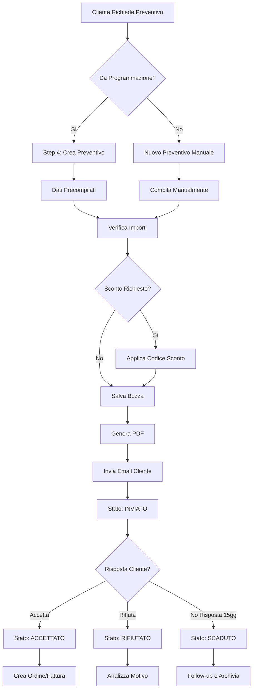

# Manuale Utente - Gestione Preventivi

## 📌 Panoramica

Il modulo **Preventivi** permette di generare quotazioni professionali per corsi, DVR, RSPP e altri servizi ElementMedica, con calcolo automatico IVA, applicazione sconti e generazione PDF.

## 🎯 Obiettivi

- **Creare preventivi** personalizzati da programmazioni o da zero
- **Applicare sconti** con codici promozionali
- **Generare PDF** professionali con logo e branding
- **Tracciare stato** (Bozza, Inviato, Accettato, Rifiutato)
- **Gestire workflow** da quotazione ad ordine confermato

---

## 🚀 Quick Start

### Creare un Preventivo da Programmazione (Step 4)

1. **Naviga** a una programmazione corso esistente
2. In **Step 4 - Generazione Preventivi**, clicca **[+ Crea Preventivo]**
3. I campi vengono **precompilati** automaticamente:
   - Tipo Servizio: `CORSO`
   - Titolo: Nome del corso
   - Descrizione: Dettagli corso
   - Cliente: Azienda o persona dalla programmazione
   - Prezzo: Da listino corso
4. **Modifica** importi o dettagli se necessario
5. Clicca **[Salva Bozza]** o **[Salva e Invia]**

✅ **Risultato**: Preventivo con numero auto-generato (es. `PREV-2025-0042`)

### Creare un Preventivo Manuale

1. Vai su **Vendite** > **Preventivi**
2. Clicca **[+ Nuovo Preventivo]**
3. Compila:
   - **Tipo Servizio**: CORSO | DVR | RSPP | MEDICO_COMPETENTE | PRIVACY | ALTRO
   - **Titolo Servizio**: "Corso Sicurezza Lavoro Base"
   - **Descrizione**: Dettagli completi del servizio
   - **Prezzo Totale**: €1,000.00
   - **Cliente**: Seleziona Azienda o Persona
   - **Data Emissione**: Oggi
   - **Data Validità**: 30 giorni da oggi
4. Clicca **[Salva]**

---

## 📋 Funzionalità Dettagliate

### 1. Campi del Preventivo

#### 🔴 Campi Obbligatori

| Campo | Descrizione | Esempio |
|-------|-------------|---------|
| **Numero** | Auto-generato | `PREV-2025-0042` |
| **Tipo Servizio** | Categoria servizio | `CORSO` |
| **Titolo Servizio** | Nome servizio | `Corso Sicurezza Base` |
| **Descrizione** | Dettagli completi | `Formazione obbligatoria 8 ore D.Lgs 81/08 per lavoratori...` |
| **Prezzo Totale** | Prezzo base | €1,500.00 |
| **Data Emissione** | Data creazione | 09/11/2025 |
| **Data Validità** | Scadenza offerta | 09/12/2025 |
| **Cliente** | Azienda O Persona | Acme Corp S.r.l. |

#### 🔵 Campi Opzionali

| Campo | Descrizione | Default | Quando Usare |
|-------|-------------|---------|--------------|
| **Spese Accessorie** | Costi extra (trasferte, materiali) | €0.00 | Servizi on-site con trasferta |
| **Aliquota IVA** | Percentuale IVA | 22% | Cambia solo per regime speciale |
| **Note** | Annotazioni interne | - | Condizioni particolari, reminder |
| **Meta Preventivo** | JSON flessibile | {} | Campi custom (es. num partecipanti) |

### 2. Calcolo Automatico Importi

Il sistema calcola automaticamente:

```
1. SUBTOTALE = prezzoTotale + speseAccessorie
2. SCONTO TOTALE = Σ(sconti applicati)
3. IMPONIBILE = subtotale - scontoTotale
4. IMPORTO IVA = imponibile × (aliquotaIva / 100)
5. IMPORTO FINALE = imponibile + importoIva
```

**Esempio Completo**:
```
Preventivo Base:
  Prezzo Totale:        €1,500.00
  Spese Accessorie:        €50.00
  ─────────────────────────────────
  Subtotale:            €1,550.00

Sconti Applicati:
  PROMO20 (20%):        -€310.00
  (capped a)            -€200.00
  ─────────────────────────────────
  Imponibile:           €1,350.00

IVA:
  Aliquota IVA (22%):     €297.00
  ─────────────────────────────────
  TOTALE FINALE:        €1,647.00
```

### 3. Stati del Preventivo

#### 📝 BOZZA (Default)

**Descrizione**: Preventivo in preparazione

**Azioni Disponibili**:
- ✏️ Modifica tutti i campi
- 🗑️ Elimina
- 🔄 Applica/Rimuovi sconti
- 📄 Genera PDF (transisce a INVIATO)

**Colore Badge**: 🟡 Giallo

---

#### ✉️ INVIATO

**Descrizione**: PDF generato e/o email inviata

**Transizione Automatica**:
- Click su [📄 Genera PDF]
- Sistema imposta `emailInviatoIl = now()`

**Azioni Disponibili**:
- 👁️ Visualizza
- 📄 Rigenera PDF (se modificato)
- ✅ Accetta
- ❌ Rifiuta

**Colore Badge**: 🔵 Blu

---

#### ✅ ACCETTATO

**Descrizione**: Cliente ha accettato l'offerta

**Transizione Manuale**:
- Commerciale clicca [✅ Accetta Preventivo]
- Sistema imposta `accettatoIl = now()`

**Azioni Disponibili**:
- 👁️ Visualizza
- 📄 Stampa PDF
- 🔄 Crea Ordine (futuro)

**Colore Badge**: 🟢 Verde

**Nota**: Stato finale positivo - non più modificabile

---

#### ❌ RIFIUTATO

**Descrizione**: Cliente ha rifiutato l'offerta

**Transizione Manuale**:
- Commerciale clicca [❌ Rifiuta]
- (Opzionale) Inserisce motivazione in `note`

**Azioni Disponibili**:
- 👁️ Visualizza
- 📊 Analizza (report rifiuti)

**Colore Badge**: 🔴 Rosso

**Nota**: Stato finale negativo - archiviato

---

#### ⏰ SCADUTO

**Descrizione**: Data validità superata senza accettazione

**Transizione Automatica**:
- Sistema verifica ogni notte
- Se `dataValidita < oggi` AND `stato = BOZZA|INVIATO`
- → Imposta `stato = SCADUTO`

**Azioni Disponibili**:
- 👁️ Visualizza
- 🔄 Duplica e rinnova (crea nuovo preventivo)

**Colore Badge**: ⚪ Grigio

---

#### 🚫 ANNULLATO

**Descrizione**: Preventivo annullato manualmente

**Transizione Manuale**:
- Admin clicca [🚫 Annulla]
- Inserisce motivazione

**Uso Tipico**:
- Errore di inserimento
- Cliente non più interessato prima invio
- Duplicato per errore

**Colore Badge**: ⚫ Nero

---

### 4. Applicazione Sconti

#### Workflow Step-by-Step

1. **Apri preventivo** in stato BOZZA o INVIATO
2. Nella sezione **Sconti**, clicca **[+ Applica Sconto]**
3. **Seleziona codice** dalla dropdown o cerca per codice
   ```
   🔍 Cerca codice: [PROMO20     ]
   
   Risultati:
   ☑️ PROMO20 - Promozione Natale (20%)
      Validità: 01/01/2025 - 31/12/2025
      Utilizzi: 15/100
   ```
4. Click su codice → **Anteprima calcolo**:
   ```
   Preventivo:
     Subtotale: €1,550.00
   
   Sconto PROMO20 (20%):
     Sconto teorico: €310.00
     Cap massimo: €200.00
     ────────────────────────
     Sconto applicato: €200.00
   
   Nuovo Totale: €1,647.00
   (risparmio: €200.00)
   ```
5. Conferma **[Applica]**

✅ **Risultato**: Sconto aggiunto, totali ricalcolati

#### Gestire Sconti Multipli

**Scenario**: Preventivo con più codici

**Regola**: Solo se codici hanno `cumulabile: true`

**Esempio**:
```
Codice 1: PROMO10 (10%, cumulabile)
Codice 2: VIP5 (5%, cumulabile)

Calcolo:
  Subtotale: €1,000.00
  Sconto PROMO10: €1,000 × 10% = €100.00
  Subtotale dopo: €900.00
  Sconto VIP5: €900 × 5% = €45.00
  ────────────────────────────────────
  Imponibile finale: €855.00
```

**Nota**: Sconti percentuali si applicano **sequenzialmente**, non sommati.

#### Rimuovere Sconto

1. Nella sezione **Sconti Applicati**:
   ```
   Sconti Applicati:
   ┌─────────────────────────────────────────┐
   │ PROMO20 - Promozione Natale             │
   │ Tipo: Percentuale (20%)                 │
   │ Sconto: €200.00                         │
   │ Applicato da: Mario Rossi               │
   │ Data: 05/11/2025 10:30                  │
   │ [🗑️ Rimuovi]                            │
   └─────────────────────────────────────────┘
   ```
2. Click **[🗑️ Rimuovi]**
3. Conferma
4. Totali ricalcolati automaticamente

### 5. Generazione PDF

#### Template PDF

Il PDF viene generato usando template configurato in sistema che include:
- **Header**: Logo ElementMedica, dati azienda
- **Info Preventivo**: Numero, data emissione, validità
- **Dati Cliente**: Azienda/Persona, indirizzo, P.IVA/CF
- **Dettaglio Servizio**: Tipo, titolo, descrizione completa
- **Tabella Prezzi**:
  ```
  ┌────────────────────────────────────────────────────────┐
  │ Descrizione                    Quantità    Prezzo      │
  ├────────────────────────────────────────────────────────┤
  │ Corso Sicurezza Base              1      €1,500.00    │
  │ Spese Accessorie                  1         €50.00    │
  │                                           ──────────   │
  │ Subtotale                                €1,550.00    │
  │                                                        │
  │ Sconti Applicati:                                      │
  │   - PROMO20 (20%)                        -€200.00    │
  │                                           ──────────   │
  │ Imponibile                               €1,350.00    │
  │ IVA (22%)                                  €297.00    │
  │                                           ──────────   │
  │ TOTALE                                   €1,647.00    │
  └────────────────────────────────────────────────────────┘
  ```
- **Condizioni**: Validità, modalità pagamento, note legali
- **Footer**: Coordinate bancarie, contatti, firma

#### Generare PDF

**Metodo 1: Da Dettaglio Preventivo**
1. Apri preventivo
2. Click **[📄 Genera PDF]**
3. Browser scarica `preventivo-PREV-2025-0042.pdf`
4. Stato transisce automaticamente a `INVIATO`

**Metodo 2: Da Lista Preventivi**
1. Nella lista, click icona [📄] sulla riga
2. Download immediato

**Metodo 3: API**
```bash
curl -X GET "http://localhost:4001/api/preventivi/{id}/pdf" \
  -H "Authorization: Bearer $TOKEN" \
  --output preventivo.pdf
```

#### Rigenerare PDF dopo Modifiche

Se modifichi preventivo dopo primo invio:
1. Modifica campi (prezzo, sconto, note)
2. Click **[💾 Salva]**
3. Click **[📄 Rigenera PDF]**
4. Nuovo PDF con data aggiornata

### 6. Invio Email Cliente

**Workflow Integrato** (Step 4 Programmazione):

1. **Genera PDF** come sopra
2. Sistema apre modal **Invio Email**:
   ```
   ┌──────────────────────────────────────────┐
   │ Invia Preventivo via Email               │
   ├──────────────────────────────────────────┤
   │ A: info@acmecorp.it                      │
   │ Cc: [vuoto]                              │
   │ Oggetto: Preventivo PREV-2025-0042       │
   │          Corso Sicurezza Base            │
   │                                          │
   │ Messaggio:                               │
   │ Gentile Cliente,                         │
   │ In allegato il preventivo richiesto.    │
   │ Rimaniamo a disposizione...              │
   │                                          │
   │ Allegati:                                │
   │ 📎 preventivo-PREV-2025-0042.pdf (85KB)  │
   │                                          │
   │ [Annulla]          [📧 Invia Email]      │
   └──────────────────────────────────────────┘
   ```
3. Personalizza testo se necessario
4. Click **[📧 Invia Email]**
5. Sistema:
   - Invia email tramite SMTP configurato
   - Imposta `emailInviatoDa = userId`
   - Imposta `emailInviatoIl = timestamp`
   - Aggiorna `stato = INVIATO`

**Tracking**: Nella sezione "Storico Email" del preventivo:
```
Email Inviata:
  Da: Mario Rossi (mario.rossi@elementmedica.it)
  A: info@acmecorp.it
  Data: 09/11/2025 11:45
  Allegato: preventivo-PREV-2025-0042.pdf
  Stato: ✅ Consegnata
```

---

## 🎓 Casi d'Uso Comuni

### Caso 1: Preventivo Standard da Programmazione

**Scenario**: Corso programmato, cliente richiede preventivo

**Workflow**:
1. **Programmazione** → Step 4
2. **[+ Crea Preventivo]** → Campi precompilati
3. **Verifica** importi (es. listino €1,200 + €50 trasferta)
4. **[Salva e Genera PDF]**
5. **Allega PDF** a email manuale o usa integrazione
6. Cliente riceve e valuta

**Tempo**: ~2 minuti

---

### Caso 2: Preventivo con Sconto Commerciale

**Scenario**: Cliente chiede sconto, commerciale offre 15%

**Workflow**:
1. **Crea preventivo** standard (€1,500)
2. **Manager** crea codice sconto:
   ```
   Codice: ACME15
   Tipo: PERCENTUALE
   Valore: 15%
   Applicabile A: AZIENDE_SPECIFICHE (Acme Corp)
   Validità: 1 mese
   ```
3. **Commerciale** applica codice al preventivo
4. **Verifica** nuovo totale: €1,275 + IVA
5. **Genera PDF** con sconto evidenziato
6. **Invia** a cliente

**Vantaggio**: Tracciabilità sconto, approvazione manager

---

### Caso 3: Preventivo Multi-Servizio

**Scenario**: Cliente vuole DVR + Corso Antincendio

**Workflow Opzione A (Preventivo Unico)**:
1. **[+ Nuovo Preventivo]**
2. **Tipo Servizio**: `ALTRO` o `CORSO` (principale)
3. **Titolo**: "Pacchetto Sicurezza Completo"
4. **Descrizione**:
   ```
   Il presente preventivo include:
   
   1. Documento Valutazione Rischi (DVR)
      - Sopralluogo sede aziendale
      - Redazione documento completo
      - Consegna formato digitale e cartaceo
      Importo: €800.00
   
   2. Corso Antincendio Rischio Medio
      - Durata: 8 ore
      - Max 20 partecipanti
      - Attestati validi 5 anni
      Importo: €700.00
   
   Totale servizi: €1,500.00
   ```
5. **Prezzo Totale**: €1,500.00
6. **Genera PDF**

**Workflow Opzione B (Due Preventivi)**:
1. Preventivo 1: DVR (€800)
2. Preventivo 2: Corso (€700)
3. Cliente può accettare separatamente

**Consiglio**: Usa Opzione A con sconto su pacchetto completo

---

### Caso 4: Rinegoziazione Preventivo Rifiutato

**Scenario**: Cliente rifiuta per prezzo, commerciale rilancia con sconto

**Workflow**:
1. **Preventivo originale**: €2,000, stato `RIFIUTATO`
2. **Commerciale** contatta cliente, offre 10% sconto
3. **Duplica preventivo**:
   - Click [📋 Duplica] su preventivo rifiutato
   - Sistema crea nuova bozza `PREV-2025-0043`
4. **Applica sconto** `RINEGOZIAZIONE10`
5. **Modifica note**: "Preventivo rinegoziato con condizioni speciali"
6. **Genera PDF** e reinvia

**Tracciabilità**: Entrambi i preventivi sono collegati in sistema

---

### Caso 5: Preventivo Urgente con Approvazione Rapida

**Scenario**: Cliente chiede preventivo entro 1 ora

**Fast Track**:
1. **Step 4** da programmazione esistente
2. **[Crea Preventivo]** → Dati precompilati
3. **Verifica rapida** importi
4. **Genera PDF** (no sconti per velocità)
5. **Invia via WhatsApp Business** (manuale) o email
6. Cliente conferma per telefono
7. **Commerciale** marca `ACCETTATO` in sistema

**Tempo**: ~5 minuti

---

## 📊 Dashboard e Reportistica

### Vista Lista Preventivi

**Filtri Disponibili**:
```
┌─────────────────────────────────────────────────────┐
│ Stato: [Tutti ▼] [BOZZA] [INVIATO] [ACCETTATO]    │
│ Periodo: [Ultimo mese ▼] Da: [__/__/____]         │
│          A: [__/__/____]                           │
│ Cliente: [Cerca cliente........................]    │
│ Tipo: [Tutti ▼] [CORSO] [DVR] [RSPP]              │
│ Ricerca: [Cerca per numero o titolo..........] 🔍 │
└─────────────────────────────────────────────────────┘
```

**Tabella Risultati**:
| # | Numero | Cliente | Tipo | Importo | Stato | Data | Azioni |
|---|--------|---------|------|---------|-------|------|--------|
| 1 | PREV-2025-0042 | Acme Corp | CORSO | €1,647 | 🟢 ACCETTATO | 05/11 | [👁️][📄] |
| 2 | PREV-2025-0041 | Beta Ind. | DVR | €2,150 | 🔵 INVIATO | 04/11 | [👁️][✏️][📄] |
| 3 | PREV-2025-0040 | Gamma SpA | CORSO | €890 | 🟡 BOZZA | 03/11 | [👁️][✏️][🗑️] |

**Export**:
- **Excel**: Click [📊 Esporta Excel]
- **CSV**: Click [📄 Esporta CSV]
- **PDF Report**: Click [📑 Report PDF]

### Statistiche Dashboard

**KPI Principali**:
```
┌─────────────────────────────────────────────────────┐
│ PREVENTIVI - Mese Corrente (Novembre 2025)         │
├─────────────────────────────────────────────────────┤
│                                                     │
│ 📝 Totale Preventivi:         42                   │
│ 💶 Valore Totale:          €58,450                 │
│ ✅ Tasso Accettazione:        65%                  │
│ ⏱️  Tempo Medio Chiusura:     7 giorni             │
│                                                     │
│ Per Stato:                                          │
│   🟡 Bozze:          8 (19%)  €9,200              │
│   🔵 Inviati:       12 (29%)  €18,300             │
│   🟢 Accettati:     18 (43%)  €25,950             │
│   🔴 Rifiutati:      3 (7%)   €4,100              │
│   ⚪ Scaduti:        1 (2%)   €900                │
│                                                     │
│ Per Tipo Servizio:                                  │
│   CORSO:           28 (67%)  €35,200              │
│   DVR:              8 (19%)  €15,800              │
│   RSPP:             4 (10%)  €5,450               │
│   ALTRO:            2 (5%)   €2,000               │
└─────────────────────────────────────────────────────┘
```

**Grafici**:
- 📊 **Trend Mensile**: Valore preventivi ultimi 12 mesi
- 🥧 **Distribuzione Stati**: Pie chart percentuali
- 📈 **Tasso Conversione**: Linea temporale
- 💰 **Top Clienti**: Bar chart per valore

### Report Avanzati

**Report 1: Analisi Sconti**
```sql
-- Codici più usati
PROMO20:      15 utilizzi, €3,450 scontati
VIP15:        12 utilizzi, €2,100 scontati
NATALE25:      8 utilizzi, €1,850 scontati
```

**Report 2: Performance Commerciali**
```
Utente: Mario Rossi
  Preventivi Creati: 18
  Valore Totale: €28,300
  Accettati: 12 (67%)
  Ticket Medio: €1,572
```

**Report 3: Motivi Rifiuto** (da analizzare note)
```
Prezzo troppo alto:        40%
Tempi non compatibili:     30%
Già scelto competitor:     20%
Altro:                     10%
```

---

## ⚠️ Errori Comuni e Soluzioni

### ❌ "Cliente obbligatorio"

**Causa**: Né `aziendaId` né `personaId` valorizzati

**Soluzione**: Seleziona almeno un cliente (Azienda O Persona)

---

### ❌ "Data validità deve essere successiva a data emissione"

**Causa**: Validità < Emissione

**Esempio Sbagliato**:
```
Data Emissione: 10/11/2025
Data Validità: 05/11/2025  ❌
```

**Soluzione**:
```
Data Emissione: 10/11/2025
Data Validità: 10/12/2025  ✅
```

---

### ❌ "Impossibile applicare sconto - importo minimo non raggiunto"

**Scenario**: Codice richiede min €500, preventivo €300

**Soluzione**:
1. Aumenta prezzo servizi
2. Oppure usa codice senza `minImporto`
3. Oppure richiedi approvazione manager per eccezione

---

### ❌ "Template PDF non trovato"

**Causa**: Template preventivo non configurato

**Soluzione Admin**:
```sql
-- Verifica template esiste
SELECT * FROM templates 
WHERE type = 'preventivo' 
AND deletedAt IS NULL;

-- Se mancante, carica template
-- Via Admin UI: Impostazioni > Template > Carica Preventivo
```

---

### ❌ "Errore generazione PDF"

**Cause Possibili**:
1. **Template corrotto**: Ricarica template
2. **Dati mancanti**: Verifica tutti campi obbligatori compilati
3. **Markers non risolti**: Controlla console errori

**Debug**:
```javascript
// Console browser (F12)
// Cerca errori tipo:
// "Marker {{azienda.ragioneSociale}} not found"
```

**Soluzione**: Correggi template o dati mancanti

---

### ❌ "Preventivo non modificabile - stato ACCETTATO"

**Causa**: Preventivi accettati/rifiutati sono frozen

**Soluzione**:
- **Non modificare**: Crea nuovo preventivo duplicando
- **Urgente**: Admin può forzare unlock (scoraggiato)

---

## 🔐 Permessi e Ruoli RBAC

### Matrice Permessi

| Ruolo | Read | Create | Update | Delete | Apply Sconto | Generate PDF | Accept/Reject |
|-------|------|--------|--------|--------|--------------|--------------|---------------|
| **Admin** | ✅ | ✅ | ✅ | ✅ | ✅ | ✅ | ✅ |
| **Manager** | ✅ | ✅ | ✅ | ❌ | ✅ | ✅ | ✅ |
| **Commerciale** | ✅ | ✅ | ✅ | ❌ | ✅ | ✅ | ✅ |
| **Segreteria** | ✅ | ✅ | ❌ | ❌ | ❌ | ✅ | ❌ |
| **Viewer** | ✅ | ❌ | ❌ | ❌ | ❌ | ❌ | ❌ |

### Configurare Ruolo Commerciale

```sql
-- Via SQL o Admin UI
INSERT INTO person_permissions (personId, permission)
VALUES 
  ('uuid-commerciale', 'preventivi_read'),
  ('uuid-commerciale', 'preventivi_create'),
  ('uuid-commerciale', 'preventivi_update'),
  ('uuid-commerciale', 'codici_sconto_read');
```

---

## 📝 Best Practices

### ✅ DO - Buone Pratiche

1. **Descrizioni Dettagliate**
   ```
   ✅ BUONO:
   "Corso Sicurezza Lavoro Base (8 ore)
   - D.Lgs 81/08 Art. 37
   - Max 20 partecipanti
   - Include: Manuale, test finale, attestato
   - Validità: 5 anni
   - Docente qualificato"
   
   ❌ SCARSO:
   "Corso sicurezza"
   ```

2. **Validità Standard**
   - Preventivi standard: 30 giorni
   - Preventivi custom: 15 giorni
   - Offerte speciali: 7 giorni

3. **Note Chiare**
   ```
   ✅ "Cliente ha richiesto fatturazione differita 60gg"
   ✅ "Da confermare disponibilità docente prima invio"
   ❌ "vedi email"  (poco tracciabile)
   ```

4. **Versionamento**
   - Se cliente chiede modifiche → Duplica e crea V2
   - Non modificare preventivo già inviato
   - Mantieni storico rinegoziazioni

5. **Follow-up Tempestivi**
   - INVIATO da >3 giorni → Email reminder
   - INVIATO da >7 giorni → Telefonata
   - INVIATO da >15 giorni → Stato SCADUTO

### ❌ DON'T - Errori da Evitare

1. **Non Inviare Bozze**
   - Genera sempre PDF prima di inviare
   - Verifica totali calcolati correttamente

2. **Non Modificare dopo Invio**
   - Se necessario → Duplica e crea nuovo
   - Mantieni versioni per tracciabilità

3. **Non Usare Sconti senza Approvazione**
   - Sconti >10%: Richiedi approvazione manager
   - Documenta motivazione in note

4. **Non Dimenticare Follow-up**
   - Sistema non invia reminder automatici (per ora)
   - Imposta promemoria manuali

5. **Non Ignorare Scaduti**
   - Analizza mensilmente preventivi scaduti
   - Contatta clienti per capire motivi

---

## 🔄 Workflow Completo (Best Case)



---

## 🛠️ Troubleshooting Avanzato

### Debug Calcolo Errato

**Strumento**: Browser DevTools Console

1. Apri preventivo
2. Premi `F12` → Tab Console
3. Digita:
   ```javascript
   // Visualizza oggetto preventivo
   console.log(window.__PREVENTIVO_DEBUG__);
   
   // Output:
   {
     prezzoTotale: 1500,
     speseAccessorie: 50,
     subtotale: 1550,
     sconti: [
       {codice: "PROMO20", importo: 200}
     ],
     scontoTotale: 200,
     imponibile: 1350,
     aliquotaIva: 22,
     importoIva: 297,
     importoFinale: 1647
   }
   ```

### Verificare Permessi RBAC

```javascript
// Console browser
fetch('/api/preventivi/test-permissions', {
  headers: {
    'Authorization': 'Bearer ' + localStorage.getItem('token')
  }
})
.then(r => r.json())
.then(data => console.log('Permessi:', data.permissions));
```

### Log Audit Trail

**Vedi chi ha modificato cosa**:

```sql
-- Via SQL (Admin only)
SELECT 
  action,
  tableName,
  recordId,
  changes,
  performedBy,
  performedAt
FROM gdpr_audit_log
WHERE tableName = 'preventivi'
  AND recordId = 'uuid-preventivo'
ORDER BY performedAt DESC;
```

---

## 📞 Supporto e Risorse

### Documentazione Collegata
- [Guida Codici Sconto](./CODICI_SCONTO_GUIDE.md)
- [API Reference](../technical/api/README.md)
- [Testing Report](../testing/FASE_6_TESTING_REPORT.md)

### Video Tutorial (Da Creare)
- [ ] "Creare il tuo primo preventivo" (3 min)
- [ ] "Applicare sconti e promozioni" (4 min)
- [ ] "Generare e inviare PDF" (2 min)
- [ ] "Gestire stati e workflow" (5 min)

### FAQ

**D: Posso modificare il numero preventivo?**  
R: No, è auto-generato. Se serve cambiarlo (es. recupero da vecchio sistema), contatta admin.

**D: Quanto tempo ho per generare il PDF?**  
R: Nessun limite, ma best practice è generarlo entro 24h dalla creazione.

**D: Posso avere più clienti (Azienda + Persona)?**  
R: No, è mutuamente esclusivo. Se fattura a persona ma servizio per azienda, usa note.

**D: Lo sconto viene applicato prima o dopo IVA?**  
R: Prima. Ordine: Subtotale → Sconto → Imponibile → IVA → Totale.

**D: Posso eliminare definitivamente un preventivo?**  
R: No, solo soft delete (GDPR). Il record rimane con `deletedAt`.

---

**Versione**: 1.0.0  
**Ultimo Aggiornamento**: 9 Novembre 2025  
**Autori**: ElementMedica Dev Team  
**Stato**: ✅ Completo e Validato
